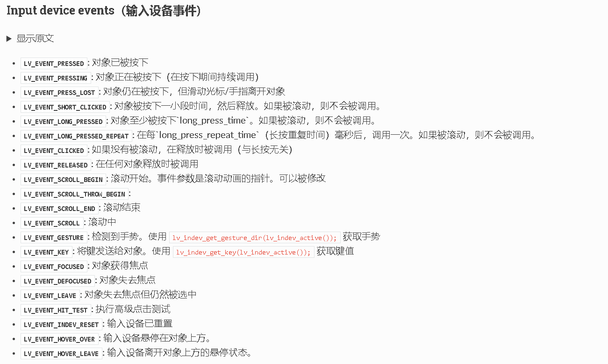
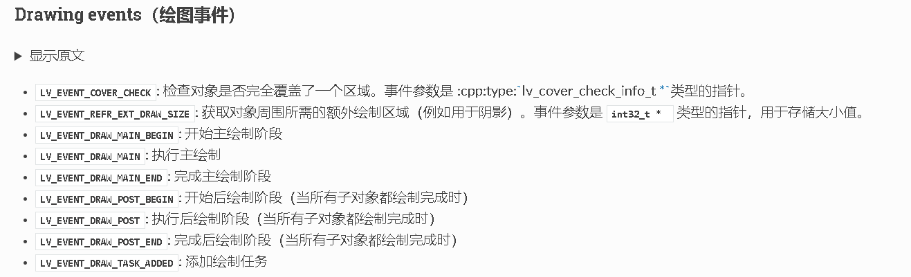
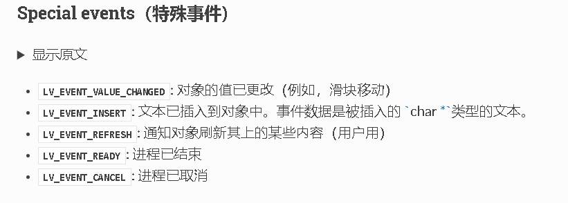
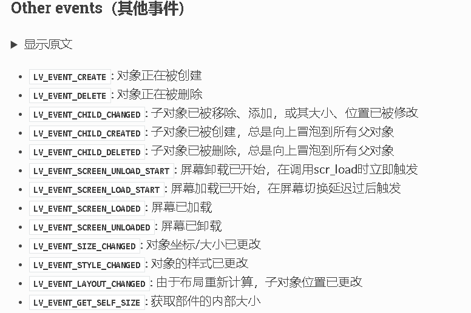
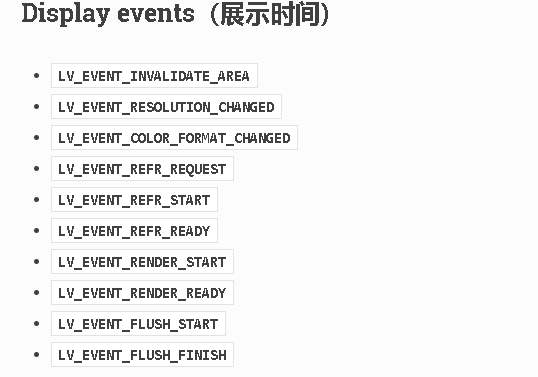
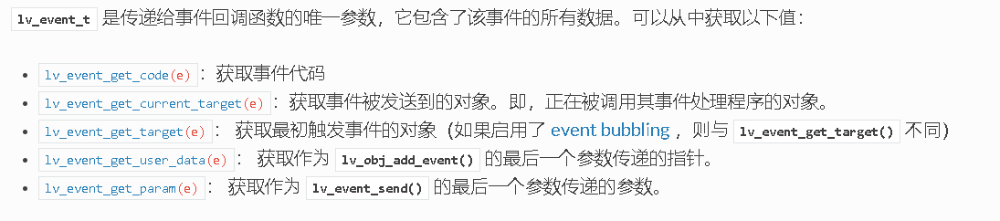

# lvgl_ui

lvgl 学习

#第一天
一. lvgl的三层屏幕
    API:
        lv_screen_active()          活动屏幕    (screen_active)
        lv_layer_top()              顶层        (top layer)
        lv_layer_sys()              系统层      (system layer)

系统层 > 顶层 > 活动屏幕
优先级高的屏幕会覆盖优先级低的屏幕

二. lvgl对象大小
    API:
        lv_obj_set_size(obj,x,y)
        lv_obj_set_width(obj,x)
        lv_obj_set_height(obj,y)

    
    LV_PCT(n)       %n
    API:    
        获取实际大小
        w = lv_obj_get_width(obj)
        h = lv_obj_get_height(obj)
        获取实际可用的大小
        content_w = lv_obj_get_content_width(obj);
        content_h = lv_obj_get_content_height(obj);

    为了提高性能,当我们设定了对象的位置、大小、布局后,LVGL不会立即更新对象的这些属性,而是将对象标记为dirty,在重新绘制屏幕之前,LVGL会检查是否有任何的dirty对象,如果有则会刷新它们的位置、大小、布局。
    所以如果要获取对象的位置、大小、布局,并且这些属性刚刚被重新设置,那么此时LVGL就需要强制刷新。
    强制刷新:   lv_obj_update_layout(obj);

三. lvgl对象位置
    API:
        设置坐标
        lv_obj_set_x(obj,x);
        lv_obj_set_y(obj,y);
        lv_obj_set_pos(obj,x,y);

    API:    
        参考父类对象对齐
        lv_obj_set_align(obj,LV_ALIGN_CENTER);
        参考父类对象对齐,并设置坐标
        lv_obj_align(obj,LV_ALIGN_CENTER,x,y);
        可以参考任何对象对齐,并设置坐标
        lv_obj_align_to(obj,base_obj,LV_ALIGN_CENTER,x,y)

        对齐后,对象坐标原点变更

    API:
        获取对象相对于父类对象LCD坐标系的左上角坐标
        lv_obj_get_x(obj);
        lv_obj_get_y(obj);
        获取对象相对于父类对象LCD坐标系的右下角坐标
        lv_obj_get_x2(obj);
        lv_obj_get_y2(obj);
        获取对象相对于自身对齐后坐标系的坐标偏移
        lv_obj_get_x_aligned(obj);
        lv_obj_get_y_aligned(obj);

三. lvgl盒子模型

    

四. 样式
    
    1. 本地样式,在LVGL内部管理样式,足够灵活但消耗内存
        lv_obj_set_style_bg_color(sub_obj1,obj1_bg_color,0);
        lv_obj_set_style_size(sub_obj1,100,100,0);

    2.  正常样式 由用户管理样式,相较于本地样式不够灵活,但可以较为方便的为需要差不多样式的对象赋予样式
        static lv_style_t style;
        lv_style_init(&style);
        lv_style_set_size(&style,100,100);
        lv_style_set_bg_color(&style,lv_color_hex(0x963214));
        lv_style_set_border_width(&style,2);

    3.  添加样式
        lv_obj_add_style(sub_obj1,&style,0);

    4.  控件组成和状态
        一个控件可能由多个部分组成,比如滚动条，就是由背景,指示器,旋钮组成,
        这种结构可以使我们对控件的各个部分进行个性化的设置样式。
        在LVGL中存在许多状态,比如按下状态、释放状态等,而LVGL可以对处于不同
        状态的控件赋予不同的设置样式

五. 事件

    1.  添加事件到控件
        lv_obj_t * btn = lv_button_create(lv_screen_active());
        lv_obj_add_event_cb(btn, my_event_cb, LV_EVENT_CLICKED, NULL);   /*分配一个事件回调*/

        static void my_event_cb(lv_event_t * event)
        {
            printf("Clicked\n");
        }

    2.  LVGL中的大部分事件
        
        
        
        
        

    3.  获取事件的数据API
        

    4.  事件冒泡
        如果启用了 lv_obj_add_flag(obj, LV_OBJ_FLAG_EVENT_BUBBLE)，那么所有事件也会发送给对象的父对象。如果父对象也启用了 LV_OBJ_FLAG_EVENT_BUBBLE，那么该事件将继续被发送给其父对象，依此类推。
        事件的 target 参数始终是当前的目标对象，而不是原始对象。要获取原始目标对象，可以在事件处理函数中调用 lv_event_get_target_obj(e)。

