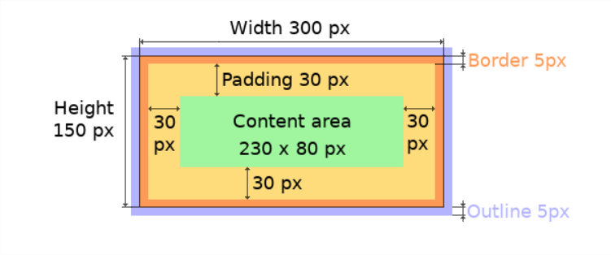

# lvgl_ui

lvgl 学习

#第一天
一. lvgl的三层屏幕
    API:
        lv_screen_active()          活动屏幕    (screen_active)
        lv_layer_top()              顶层        (top layer)
        lv_layer_sys()              系统层      (system layer)

系统层 > 顶层 > 活动屏幕
优先级高的屏幕会覆盖优先级低的屏幕

二. lvgl对象大小
    API:
        lv_obj_set_size(obj,x,y)
        lv_obj_set_width(obj,x)
        lv_obj_set_height(obj,y)

    
    LV_PCT(n)       %n
    API:    
        获取实际大小
        w = lv_obj_get_width(obj)
        h = lv_obj_get_height(obj)
        获取实际可用的大小
        content_w = lv_obj_get_content_width(obj);
        content_h = lv_obj_get_content_height(obj);

    为了提高性能,当我们设定了对象的位置、大小、布局后,LVGL不会立即更新对象的这些属性,而是将对象标记为dirty,在重新绘制屏幕之前,LVGL会检查是否有任何的dirty对象,如果有则会刷新它们的位置、大小、布局。
    所以如果要获取对象的位置、大小、布局,并且这些属性刚刚被重新设置,那么此时LVGL就需要强制刷新。
    强制刷新:   lv_obj_update_layout(obj);

三. lvgl对象位置
    API:
        设置坐标
        lv_obj_set_x(obj,x);
        lv_obj_set_y(obj,y);
        lv_obj_set_pos(obj,x,y);

    API:    
        参考父类对象对齐
        lv_obj_set_align(obj,LV_ALIGN_CENTER);
        参考父类对象对齐,并设置坐标
        lv_obj_align(obj,LV_ALIGN_CENTER,x,y);
        可以参考任何对象对齐,并设置坐标
        lv_obj_align_to(obj,base_obj,LV_ALIGN_CENTER,x,y)

        对齐后,对象坐标原点变更

    API:
        获取对象相对于父类对象LCD坐标系的左上角坐标
        lv_obj_get_x(obj);
        lv_obj_get_y(obj);
        获取对象相对于父类对象LCD坐标系的右下角坐标
        lv_obj_get_x2(obj);
        lv_obj_get_y2(obj);
        获取对象相对于自身对齐后坐标系的坐标偏移
        lv_obj_get_x_aligned(obj);
        lv_obj_get_y_aligned(obj);

三. lvgl盒子模型

    

四. 样式
    
    1. 本地样式,在LVGL内部管理样式,足够灵活但消耗内存
        lv_obj_set_style_bg_color(sub_obj1,obj1_bg_color,0);
        lv_obj_set_style_size(sub_obj1,100,100,0);

    2.  正常样式 由用户管理样式,相较于本地样式不够灵活,但可以较为方便的为需要差不多样式的对象赋予样式
        static lv_style_t style;
        lv_style_init(&style);
        lv_style_set_size(&style,100,100);
        lv_style_set_bg_color(&style,lv_color_hex(0x963214));
        lv_style_set_border_width(&style,2);

    3.  添加样式
        lv_obj_add_style(sub_obj1,&style,0);

    4.  控件组成和状态
        一个控件可能由多个部分组成,比如滚动条，就是由背景,指示器,旋钮组成,
        这种结构可以使我们对控件的各个部分进行个性化的设置样式。
        在LVGL中存在许多状态,比如按下状态、释放状态等,而LVGL可以对处于不同
        状态的控件赋予不同的设置样式

五. 事件

    1.  添加事件到控件
        lv_obj_t * btn = lv_button_create(lv_screen_active());
        lv_obj_add_event_cb(btn, my_event_cb, LV_EVENT_CLICKED, NULL);   /*分配一个事件回调*/

        static void my_event_cb(lv_event_t * event)
        {
            printf("Clicked\n");
        }

    2.  LVGL中的大部分事件
        
        
        
        
        

    3.  获取事件的数据API
        

    4.  事件冒泡
        如果启用了 lv_obj_add_flag(obj, LV_OBJ_FLAG_EVENT_BUBBLE)，那么所有事件也会发送给对象的父对象。如果父对象也启用了 LV_OBJ_FLAG_EVENT_BUBBLE，那么该事件将继续被发送给其父对象，依此类推。
        事件的 target 参数始终是当前的目标对象，而不是原始对象。要获取原始目标对象，可以在事件处理函数中调用 lv_event_get_target_obj(e)。
    
    5.  事件的典型结构
        static void list_handle1(lv_event_t*e){
            lv_event_code_t code = lv_event_get_code(e);    /* 获取事件代码 */ 
            void* user_data = lv_event_get_user_data(e);    /* 获取用户数据 */ 
            lv_obj_t* tar_obj = lv_event_get_target_obj(e); /* 获取最初触发对象 */ 
            lv_obj_t* current_obj = lv_event_get_current_target(e); /* 获取当前对象 */
            if(code == LV_EVENT_CLICKED){
                
            }
        }

六. 定时器

    1.  定时器API
        创建定时器
        lv_timer_create(lv_timer_cb,timer_period,user_data);        
        lv_timer_create_basic();    创建没有任何参数的定时器

        设置定时器
        lv_timer_set_cb(timer,timer_cb);                        设置回调函数
        lv_timer_set_user_data(timer,user_data);                设置用户数据
        lv_timer_set_period(timer,timer_period);                设置周期
        lv_timer_set_repeat_count(timer,timer_repeat_count);    设置运行次数,到达对应次数后定时器删除

        启用/禁用定时器
        lv_timer_enabel(en)       

        暂停和恢复指定定时器
        lv_timer_resume(timer);         恢复指定定时器
        lv_timer_pause(timer);          暂停指定定时器

        获取当前定时器的空闲时间占比
        uint32_t idle = lv_timer_get_idle()        

七. 组件 

        1.label
            创建标签
            lv_label_create()   
            设置标签的文本,该API会动态分配内存缓冲区,再将文本复制到该缓冲区中
            lv_label_set_text()  
            设置标签的文本,但不会动态分配内存缓冲区,而是使用已经存在的静态缓冲区,所以这比较适合需要快速更新的内容显示
            lv_label_set_text_static() 
            当固定标签的大小后,当标签文本的高或宽大于设置的大小后,可以使用长模式去决定显示方式
            lv_label_set_long_mode()

        2.switch
            创建开关
            lv_switch_create()
            手动设置开关的状态
            lv_obj_remove_state(sw,LV_STATE_CHECKED);   /* 将状态变为关闭 */
            lv_obj_add_state(sw,LV_STATE_CHECKED);      /* 将状态变为开启 */
            获取开关的状态
            lv_obj_has_state(sw,LV_STATE_CHECKED)

        3.led
            创建led
            lv_led_create()
            开关led
            lv_led_on();
            lv_led_off();
            设置led亮度
            lv_led_set_brightness()
            设置led颜色
            lv_led_set_color()

        4. list
            创建list
            lv_list_create()
            为list添加按钮
            btn = lv_list_add_button()
            lv_obj_add_event_cb(btn,list_handle1,LV_EVENT_CLICKED,list);
            为list添加文本
            lv_list_add_text()

        5.  键盘
            创建键盘
            lv_keyboard_create()
            设置键盘模式
            lv_keyboard_set_mode()
            这三种模式可以直接转换
            {
                LV_KEYBOARD_MODE_SPECIAL
                LV_KEYBOARD_MODE_TEXT_UPPER
                LV_KEYBOARD_MODE_TEXT_LOWER
            }
            LV_KEYBOARD_MODE_NUMBER
            为键盘分配一个文本区域
            lv_keyboard_set_textarea(key_board,text_area);
            按下按键后弹出对应提示框
            lv_keyboard_set_popovers(key_board,true);
            隐藏/显示键盘
            lv_obj_add_flag(key_board,LV_OBJ_FLAG_HIDDEN);      /* 隐藏键盘 */
            lv_obj_remove_flag(key_board,LV_OBJ_FLAG_HIDDEN);   /* 显示键盘 */

